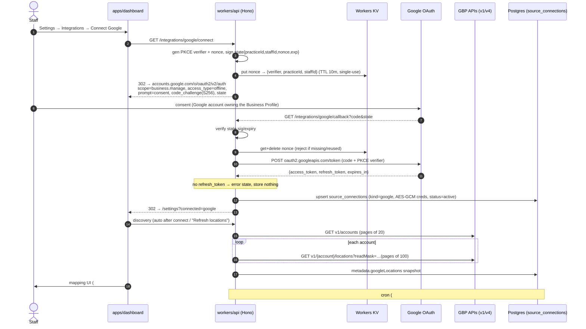

# ADR 0002: Google Business Profile API integration — access, quotas, API surface

- **Status:** Accepted
- **Date:** 2026-07-11
- **Deciders:** Epic #7 spike (#117)

## Context

Epic #7 connects a practice's Google Business Profile via OAuth, polls reviews, publishes replies, and (Epic #18) snapshots profile data. The Google Business Profile (GBP) API family is not a normal public API: a Google Cloud project starts with a **quota of 0 QPM** and must pass a manual, per-project access review before any call succeeds. Reviews live on a legacy-but-active v4 surface while everything else moved to v1 per-purpose APIs. This ADR records what was verified against current (July 2026) Google documentation so #118/#121/#123/#125/#127/#130/#156 can proceed without re-research.

All claims below were checked against Google's own docs on 2026-07-11; third-party/community claims are marked as such.

## Decision

We will build against the API surface, scope, and polling model documented below; the access request and OAuth verification are **human action items to start immediately** (they gate production, not development — all dev/test runs against the fake GBP server, #130).

### 1. Access process and lead time

- **Form:** https://support.google.com/business/contact/api_default — select **"Application for Basic API Access"**. (The same form, with "Quota Increase Request" selected, is the quota-increase path.)
- **Approval is per-GCP-project**: the form requires the **project number** of the exact Google Cloud project that will call the APIs. Approval of one project does not transfer.
- **Eligibility** (from https://developers.google.com/my-business/content/prereqs):
  - manage a GBP that is **verified and active for 60+ days** (own or client's);
  - have a **live website representing that business**;
  - apply from an **email address that is an owner/manager on that Business Profile**, ideally on the business's own domain (community reports: mismatched email/website domains are the top rejection cause).
- **Before approval:** effectively nothing works — default quota is **0 QPM** on every GBP API. There is **no sandbox** ("There's no Sandbox environment for the Business Profile APIs"); some write calls accept `validateOnly=true`, which is useless pre-approval anyway. This is why the fake server (#130) is load-bearing.
- **How you know you're approved:** a follow-up email, and the project's quota in Cloud Console flips from 0 to **300 QPM**. Then each API must still be **manually enabled** in the API Library.
- **Lead time:** Google publishes no SLA. The Help Center workflow (https://support.google.com/business/workflow/16726127) and community threads put it at **7–10 business days officially, 4 days to 6 weeks in practice**. Treat 2–6 weeks as the planning number.
- **Filing status for this spike:** the request could **not** be filed from the spike itself — it requires the real GCP project number, and it must be submitted by a person whose Google account is owner/manager on a verified GBP, from the business email. Exact steps for the project owner are in Appendix C; this is the item to kick off **now**.

### 2. API surface → issue mapping

| Need | API / endpoint (verbatim) | Issues |
|---|---|---|
| OAuth token exchange/refresh | `https://oauth2.googleapis.com/token` (standard Google OAuth 2.0) | #118, #130 |
| List accounts | `GET https://mybusinessaccountmanagement.googleapis.com/v1/accounts` — `pageSize` default **and max 20**, `pageToken` | #121 |
| List locations | `GET https://mybusinessbusinessinformation.googleapis.com/v1/{parent=accounts/*}/locations` — **`readMask` is required**, `pageSize` max 100 (default 10) | #121 |
| Get one location (profile fields) | `GET https://mybusinessbusinessinformation.googleapis.com/v1/locations/{id}?readMask=…` — fields incl. `title`, `storefrontAddress`, `phoneNumbers`, `regularHours`, `specialHours`, `websiteUri`, `categories`, `profile.description`, `metadata` | #156 |
| List reviews | `GET https://mybusiness.googleapis.com/v4/{parent=accounts/*/locations/*}/reviews` — `pageSize` **max 50**, `orderBy` valid values `rating`, `rating desc`, `updateTime desc`; response carries `averageRating`, `totalReviewCount`, `nextPageToken` | #123, #125, #130 |
| Batch reviews across locations | `POST https://mybusiness.googleapis.com/v4/accounts/{accountId}/locations:batchGetReviews` (optional optimization; supports `ignoreRatingOnlyReviews`) | #123 (optional) |
| Reply to review (upsert) | `PUT https://mybusiness.googleapis.com/v4/{name=accounts/*/locations/*/reviews/*}/reply` — "A reply is created if one does not exist"; **only valid for verified locations**; `ReviewReply.comment` max **4096 bytes** | #127, #130 |
| Delete reply | `DELETE …/reviews/*/reply` | (not in scope, exists) |
| Photo/media count | v4 `GET https://mybusiness.googleapis.com/v4/accounts/*/locations/*/media` (`totalMediaItemCount`) | #156 |
| Push notifications | My Business Notifications API v1 + Cloud Pub/Sub (see §5) | none at M1 |

**Reviews stay on v4.** Google split the monolithic My Business API into eight per-purpose APIs (all must be enabled post-approval: Google My Business API [v4], Account Management, Business Information, Notifications, Verifications, Place Actions, Lodging, Q&A). Reviews were **never migrated** off `mybusiness.googleapis.com/v4`; the v4 reviews surface is active and still receiving features in 2026 (see below), with **no announced deprecation** on https://developers.google.com/my-business/content/latest-updates. The Q&A API was shut down 2025-11-03 (irrelevant to us) — precedent that Google does retire members of this family with ~1y notice.

**Review resource shape** (v4 `Review`): `name` (`accounts/{a}/locations/{l}/reviews/{r}` — stable id for `sourceId`), `reviewId`, `reviewer { displayName, isAnonymous, profilePhotoUrl }`, `starRating` enum (`STAR_RATING_UNSPECIFIED`, `ONE`..`FIVE`), `comment` (absent for star-only), `createTime`, `updateTime`, `reviewReply { comment, updateTime, reviewReplyState, policyViolation }`, `reviewMediaItems[]`.

**New in 2026 — affects #125/#127/#130:**
- **2026-04-01:** `reviewReplyState` (`PENDING` / `REJECTED` / `APPROVED`) retrievable on reviews — owner replies are **moderated**; a successful `updateReply` PUT does not mean the reply is live.
- **2026-04-20:** `reviewMediaItems` (photo/video attachments) on reviews.
- **2026-07-01:** `policyViolation` (rejection reason) retrievable on review replies.

### 3. Quotas and polling math

Defaults after approval (https://developers.google.com/my-business/content/limits), **per project**:

- Business Information API: **300 QPM** reads; 300 QPD Create Location; 300 QPD SearchGoogleLocation; 10,000 QPD Update Location; **10 edits/min per Business Profile (cannot be increased)**.
- Account Management, Performance, Verifications, Lodging, Place Actions, Notifications: **300 QPM each**.
- The v4 Google My Business API (reviews) is no longer in the published table; its granted quota historically matches the 300 QPM family and shows in Cloud Console post-approval. **Plan to 300 QPM; read the real number from the console after approval.**
- Google's stated best practices: pace evenly (~5 req/s at 300 QPM), exponential backoff + jitter on 429, cache static data, prefer sequential pagination over parallel fan-out.
- **Quota increase:** same form, "Quota Increase Request", with company name, contact email, project number. Community experience: increases are denied when usage is <50% of current quota or spiky — i.e., we must demonstrably approach the ceiling with smooth traffic before asking.

Polite-polling math for the 6h cron (#123) — see Appendix A for the table. Headline: at 100 practices × ~2 mapped locations, one incremental tick is ~200 review-list calls (+~400 Business Info calls once #156 lands). Paced at ≤240 QPM (80% of quota), a full tick drains in **~1 minute (reviews) / ~3 minutes (with snapshots)** — comfortably inside a 6h window up to roughly **~85,000 locations** theoretical ceiling. Quota is not the M1 constraint; **burst shape is**: the cron fan-out must not fire all connection DOs simultaneously (see #123 adjustment).

### 4. OAuth decision

- **Scope: `https://www.googleapis.com/auth/business.manage` — the only choice.** Google's scope registry lists no read-only or narrower Business Profile scope; every endpoint above (including plain reads) documents `business.manage` (the legacy `plus.business.manage` alias still appears on v4 references — do not use it). Decision: request exactly this one scope.
- **Refresh-token gotchas (long-lived server access):**
  - While the OAuth consent screen is in **Testing** publishing status, refresh tokens **expire after 7 days**. Any dev against real Google will see weekly `invalid_grant` churn — expected, not a bug; #118's `needs_reauth` path covers it.
  - **Production requires OAuth verification:** `business.manage` is a **sensitive scope**, so before real users can consent without warnings (and beyond the 100-user unverified cap), the app must pass Google's **sensitive-scope verification** — privacy policy on a verified domain, homepage, scope justification, demo video; Google states up to ~10 days once submitted, in practice often longer. **This is a second human-gated track, independent of API access approval** (Appendix C).
  - Published + verified apps' refresh tokens do not time-expire, but die on: user revocation, **6 months unused**, and the **100-refresh-tokens-per-Google-account-per-client** cap (oldest silently invalidated). Our 6h polling keeps tokens warm; the 100-token cap only bites an account reconnecting absurdly often. `access_type=offline` + `prompt=consent` (#118's plan) remains the correct recipe; Google omits the refresh token on repeat consents otherwise.

### 5. Webhooks: exists, but polling is the design

A real push channel exists — the **My Business Notifications API** (v1) delivers `NEW_REVIEW` / `UPDATED_REVIEW` (and other) events to a **Cloud Pub/Sub topic in our GCP project** (grant `mybusiness-api-pubsub@system.gserviceaccount.com` publisher on the topic, then `PATCH https://mybusinessnotifications.googleapis.com/v1/accounts/{accountId}/notificationSetting` per connected account). We decide **polling-only at M1** because:

1. **One notification setting per GBP account** — if the practice (or its agency) uses any other tool that sets it, last-writer-wins clobbers the other. Unacceptable side effect of "connecting" a SaaS.
2. Notifications are pointers, not payloads — a fetch is needed anyway, and Google documents no delivery guarantee; a polling reconciliation loop is required regardless.
3. It drags Cloud Pub/Sub infrastructure into an otherwise Cloudflare-native stack.

Consequence: review latency = polling cadence (≤6h). Revisit Pub/Sub as a *latency optimization layered over* polling if the market demands near-real-time.

### 6. Connect-flow sequence

See Appendix B — the blueprint for #118/#121.

### 7. Risks and mitigations

| Risk | Likelihood / impact | Mitigation |
|---|---|---|
| API access approval delayed (2–6 wks) or rejected | Medium / High — blocks any real-Google validation | File **now** (Appendix C); all Epic #7 dev + tests run on the fake server (#130); pre-launch, one manual smoke run against real GBP. Rejection is usually fixable (email/domain mismatch, vague use case) and refiling is allowed. |
| OAuth sensitive-scope verification delays production launch | Medium / High | Start the consent-screen + privacy-policy work in parallel with M1 dev; keep the app in Testing (7-day tokens) for internal use only. |
| Quota ceiling (300 QPM/project) at scale | Low at M1 / Medium later | Appendix A math; global pacing + stagger in #123; request increase only once sustained usage >50% of quota. |
| v4 reviews API retired (Q&A precedent) | Low near-term | Base URLs injectable everywhere (#118/#123/#127 already require this); adapter isolates the shape (#125); fake server centralizes corrections (#130). Google shipped v4 review features in 2026 — no sign of imminent retirement. |
| Reply moderation (`reviewReplyState`) makes "published" a lie | Certain (mechanism exists) / Medium | #127 records state from the PUT response; poller sees `REJECTED` + `policyViolation` on subsequent syncs (adapter passes reply state through). |
| Unverified locations | Certain / Low | Replies are hard-blocked by Google on unverified locations — #121's exclusion is confirmed correct, not just prudent. |

### GO/ADJUST per downstream issue

- **#118 OAuth connect — GO, with adjustments** (commented on issue): plan holds (scope, `access_type=offline` + `prompt=consent`, PKCE, `needs_reauth` on `invalid_grant`); add the Testing-status 7-day token expiry expectation and the production verification track.
- **#121 location discovery — GO, no comment needed.** Adjust silently during implementation: `accounts.list` pages are max **20**; `locations.list` **requires `readMask`** (request `name,title,storefrontAddress,metadata` + verification signal) and pages max 100. Verification state note: the Business Information API `location` doesn't carry a simple `verificationState` string — read verified status via the Verifications API (`locations/{id}/VoiceOfMerchantState` / verifications surface) or `metadata` capability flags (e.g. absence of `hasVoiceOfMerchant` implications); confirm exact field during implementation against the fake server's abstraction. The reply endpoint being verified-only (§2) confirms the unverified-exclusion requirement.
- **#123 polling — GO, with adjustments** (commented): `orderBy=updateTime desc` confirmed; `pageSize` max **50**; add global pacing/stagger so the cron fan-out across connections respects the shared per-project 300 QPM; `batchGetReviews` available as a later optimization.
- **#125 adapter — GO, no comment needed.** Adjust silently: zod schema must **tolerate unknown/new fields** (2026 added `reviewReplyState`, `policyViolation`, `reviewMediaItems` — a strict schema would have broken three times this year); keep the *total* `starRating` check (reject unknown enum values) but pass through extra object fields; capture `reviewReply.reviewReplyState` into the existing-reply metadata alongside `comment`/`updateTime`.
- **#127 reply publishing — GO, with adjustments** (commented): endpoint + upsert semantics + 4096-byte cap all confirmed; add reply-moderation handling (`PENDING`/`REJECTED` + `policyViolation`).
- **#130 fake server — GO, no comment needed.** Endpoint paths in §2 are final; add optional `reviewReplyState` to the reply upsert response and fixtures.
- **#156 profile snapshots — GO, no comment needed.** `locations.get` + required `readMask` confirmed; photo count via **v4** `media.list` `totalMediaItemCount` (media never moved to v1 either); note appointment links live under Place Actions API (`placeActions`) if `metadata`/attributes don't carry them — confirm at implementation.

## Consequences

- Two human-gated clocks (API access, OAuth verification) start now and run in parallel with development; neither blocks M1 code because #130 decouples us.
- Everything speaks `business.manage` — a connected practice grants us full profile management. Our own permission layer (Epic #4) is the only thing narrowing what staff can do; token custody (#118 encryption) carries real weight.
- Polling-only means ≤6h review latency at M1; acceptable, revisitable.
- Committing to v4 for reviews means owning a future migration if Google ever moves reviews to v1 — contained by injectable base URLs + the adapter + fake-server seams.
- The 300 QPM/project quota makes polling capacity a *shared* resource across all tenants; #123's pacing design is a correctness requirement, not a nicety.

---

## Appendix A — quota / polling table (6h cron, defaults of 300 QPM per API, paced at 80% = 240 QPM)

Assumptions: ~2 mapped locations/practice; incremental review sync ≈ 1 list call/location/tick (50-review pages; new+edited since cursor rarely exceed one page); #156 adds ~2 Business Info/media calls/location/tick; 4 ticks/day.

| Practices | Locations | Review calls/tick (v4) | Tick duration @240 QPM | Profile calls/tick (Bus. Info + v4 media) | Calls/day total | Verdict |
|---|---|---|---|---|---|---|
| 10 | 20 | 20 | 5 s | 40 | 240 | Trivial |
| 100 | 200 | 200 | ~50 s | 400 | 2,400 | Comfortable |
| 1,000 | 2,000 | 2,000 | ~8.3 min | 4,000 | 24,000 | Fine; stagger start times |
| 10,000 | 20,000 | 20,000 | ~83 min | 40,000 | 240,000 | Still inside a 6h window; request quota increase around here |
| ~85,000 | ~170,000 | ~170,000 | ~12 h > window | — | — | Hard ceiling without increase/architecture change |

First-ever sync of a location with R reviews costs ⌈R/50⌉ calls (500 reviews = 10 calls) — noise. The un-increasable **10 edits/min/profile** limit is irrelevant to reads and to review replies (v4), and only ~1 reply/min/location would ever approach anything similar.

## Appendix B — connect-flow sequence (blueprint for #118/#121)

## Appendix C — user action items (start now; each is human-gated)

**Track 1 — Business Profile API access (gates any real API call; 2–6 weeks):**
1. Create/choose the production GCP project; record its **project number**.
2. Ensure a Google Business Profile that is **verified and 60+ days active** and that your Google account is **owner/manager** on it, with a **live website** for that business.
3. From an email on the business domain (matching the website), file https://support.google.com/business/contact/api_default → **"Application for Basic API Access"** with the project number and a concrete use case (e.g., "SaaS reputation-management platform for healthcare practices: with each practice's OAuth consent, read their reviews, publish owner replies they approve, and read their profile info").
4. Save the confirmation email/case number; check Cloud Console quotas — **0 QPM = pending, 300 QPM = approved**.
5. On approval: enable all eight Business Profile APIs in the API Library.

**Track 2 — OAuth consent screen & verification (gates production users; ~10+ days once submitted):**
1. Configure the consent screen (external), request only `https://www.googleapis.com/auth/business.manage`; keep **Testing** status for now (note: 7-day refresh-token expiry until published).
2. Prepare: privacy policy URL on our verified domain, homepage, scope justification, demo video.
3. Submit sensitive-scope verification when the connect flow (#118) is demo-able.

## Sources

- Prerequisites / access: https://developers.google.com/my-business/content/prereqs · https://support.google.com/business/workflow/16726127
- Setup / scope / no sandbox: https://developers.google.com/my-business/content/basic-setup
- Quotas: https://developers.google.com/my-business/content/limits
- Reviews: https://developers.google.com/my-business/content/review-data · https://developers.google.com/my-business/reference/rest/v4/accounts.locations.reviews · …/reviews/list · …/reviews/updateReply
- Accounts/locations: https://developers.google.com/my-business/reference/accountmanagement/rest/v1/accounts/list · https://developers.google.com/my-business/reference/businessinformation/rest/v1/accounts.locations/list
- Changes: https://developers.google.com/my-business/content/latest-updates
- Notifications: https://developers.google.com/my-business/content/notification-setup
- OAuth: https://developers.google.com/identity/protocols/oauth2 (token expiration) · https://developers.google.com/identity/protocols/oauth2/scopes · https://developers.google.com/identity/protocols/oauth2/production-readiness/sensitive-scope-verification
- Lead-time community data (leads, not authority): support.google.com Business Profile community threads; localsearchforum.com
